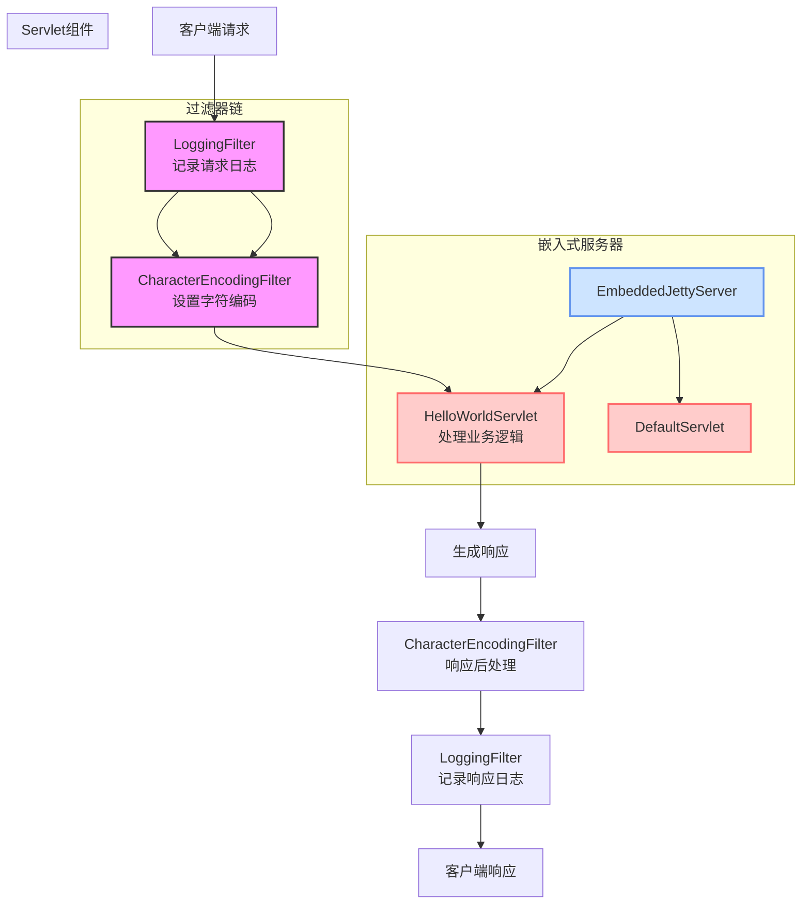

# Servlet 示例项目

这是一个基于 Java 的 Servlet 示例项目，用于演示 Servlet 的基本用法和配置。

## 项目结构

```
Servlet/
├── src/
│   └── main/
│       ├── java/
│       │   └── com/
│       │       └── zyk_test/
│       │           ├── Main.java
│       │           ├── HelloWorldServlet.java
│       │           ├── EmbeddedJettyServer.java
│       │           └── filter/
│       │               ├── LoggingFilter.java
│       │               └── CharacterEncodingFilter.java
│       └── resources/
├── pom.xml
├── Dockerfile
├── README.md
├── filter.md
└── tomcat.md
```

## 项目架构图



## 技术栈

- Java 21
- Maven 项目管理
- Jakarta Servlet API 5.0.0
- Jetty 嵌入式Web服务器
- Docker (用于部署)

## 打包方式说明

本项目支持两种打包方式：

### 1. WAR 包 (传统Web应用打包方式)
- 适用于部署到独立的Web服务器（如Tomcat、Jetty等）
- 需要将 `<packaging>` 设置为 [war](file://F:\learn\Servlet\target\Servlet-1.0-SNAPSHOT.war)
- 需要添加 `maven-war-plugin` 插件
- 需要 `web.xml` 配置文件

### 2. JAR 包 (嵌入式Web服务器方式)
- 适用于创建独立运行的应用程序
- 将 `<packaging>` 设置为 `jar`
- 使用嵌入式Web服务器（如Jetty、Tomcat等）
- 通过Java main方法启动服务器

## 如何使用

### 1. 克隆项目

```bash
git clone <项目地址>
```

### 2. 导入项目

使用 IntelliJ IDEA 或其他支持 Maven 的 IDE 导入项目。

### 3. 项目依赖

项目已配置好 Jakarta Servlet API 和 Jetty 依赖：

```xml
<!-- Jakarta Servlet API -->
<dependency>
    <groupId>jakarta.servlet</groupId>
    <artifactId>jakarta.servlet-api</artifactId>
    <version>5.0.0</version>
    <scope>provided</scope>
</dependency>

<!-- 嵌入式Web服务器 -->
<dependency>
    <groupId>org.eclipse.jetty</groupId>
    <artifactId>jetty-server</artifactId>
    <version>11.0.16</version>
</dependency>

<dependency>
    <groupId>org.eclipse.jetty</groupId>
    <artifactId>jetty-servlet</artifactId>
    <version>11.0.16</version>
</dependency>
```

### 4. Servlet 实现

项目包含一个简单的 HelloWorldServlet 示例：

```java
public class HelloWorldServlet extends HttpServlet {
    protected void doGet(HttpServletRequest request, HttpServletResponse response)
            throws ServletException, IOException {
        // 处理 GET 请求
    }
    
    protected void doPost(HttpServletRequest request, HttpServletResponse response)
            throws ServletException, IOException {
        // 处理 POST 请求
    }
}
```

### 5. 过滤器实现

项目包含两个过滤器示例：

1. **LoggingFilter** - 记录请求日志
2. **CharacterEncodingFilter** - 处理字符编码

详细说明请参考 [filter.md](file:///F:/learn/Servlet/filter.md) 文件。

### 6. 嵌入式服务器

通过 [EmbeddedJettyServer.java](file:///F:/learn/Servlet/src/main/java/com/zyk_test/EmbeddedJettyServer.java) 类使用嵌入式Jetty服务器：

```java
public class EmbeddedJettyServer {
    public static void main(String[] args) throws Exception {
        Server server = new Server(8080);
        // 配置和启动服务器
        // ...
    }
}
```

### 7. 运行项目

#### 方法一：直接运行（JAR方式）

1. 使用 Maven 构建项目：
   ```bash
   mvn clean package
   ```

2. 运行生成的 JAR 文件：
   ```bash
   java -jar target/Servlet-1.0-SNAPSHOT.jar
   ```

3. 访问应用：
   - 主页: http://localhost:8080/
   - Servlet: http://localhost:8080/hello

#### 方法二：使用 Docker（推荐）

详细步骤请参考 [tomcat.md](file:///F:/learn/Servlet/tomcat.md) 文件。

1. 构建项目：
   ```bash
   mvn clean package
   ```

2. 构建 Docker 镜像：
   ```bash
   docker build -t my-servlet-app .
   ```

3. 运行容器：
   ```bash
   docker run -d --name my-servlet-app -p 8080:8080 my-servlet-app
   ```

4. 访问应用：
   - 主页: http://localhost:8080/
   - Servlet: http://localhost:8080/hello

## 示例说明

### HelloWorldServlet 功能

1. 处理 HTTP GET 和 POST 请求
2. 返回简单的 HTML 页面
3. 显示当前服务器时间
4. 演示 Servlet 生命周期方法 ([init()](file:///F:/learn/redis/hm-dianping/src/main/java/com/hmdp/utils/PasswordEncoder.java#L10-L14), [destroy()](file:///F:/learn/redis/hm-dianping/src/main/java/com/hmdp/utils/PasswordEncoder.java#L26-L28))

### 过滤器功能

1. **LoggingFilter** - 记录请求和响应的详细信息
2. **CharacterEncodingFilter** - 统一设置字符编码

### URL 映射

- `/` - 欢迎页面 (由EmbeddedJettyServer.DefaultServlet处理)
- `/hello` - HelloWorldServlet 处理

## 许可证

本项目仅供学习和参考使用。