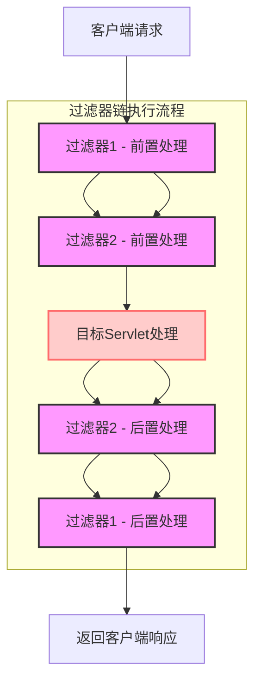

# Servlet 过滤器 (Filter) 详解

Servlet 过滤器是 Java Web 应用程序中一个重要的组件，它允许开发人员在请求到达 Servlet 之前或响应返回客户端之前对请求和响应进行预处理。

## 目录
1. [过滤器概述](#过滤器概述)
2. [过滤器的作用](#过滤器的作用)
3. [过滤器的生命周期](#过滤器的生命周期)
4. [过滤器接口方法](#过滤器接口方法)
5. [过滤器配置](#过滤滤器配置)
6. [示例代码](#示例代码)
7. [过滤器链](#过滤器链)
8. [实际应用场景](#实际应用场景)
9. [代码注释规范](#代码注释规范)
10. [异常处理](#异常处理)
11. [过滤器工作流程图](#过滤器工作流程图)
12. [最佳实践](#最佳实践)

## 过滤器概述

过滤器（Filter）是实现了 `jakarta.servlet.Filter` 接口的 Java 类，它可以对 Servlet 容器中的请求和响应进行检查和修改。过滤器通常用于执行以下任务：
- 认证和授权检查
- 日志记录和审计
- 数据压缩
- 字符编码设置
- 跨域资源共享（CORS）处理
- 请求/响应包装

## 过滤器的作用

1. **请求预处理**：在请求到达 Servlet 之前对其进行处理
2. **响应后处理**：在响应发送给客户端之前对其进行处理
3. **拦截机制**：可以阻止请求继续传递到下一个组件
4. **统一处理**：为多个 Servlet 提供统一的预处理和后处理逻辑

## 过滤器的生命周期

过滤器的生命周期由 Servlet 容器管理，包含以下阶段：

### 1. 初始化阶段
- 容器启动或 Web 应用部署时调用 `init()` 方法
- 只执行一次，用于初始化过滤器

### 2. 过滤阶段
- 每次请求/响应通过过滤器时调用 `doFilter()` 方法
- 可能执行多次

### 3. 销毁阶段
- 容器关闭或 Web 应用卸载时调用 `destroy()` 方法
- 只执行一次，用于释放资源

## 过滤器接口方法

```java
public interface Filter {
    // 初始化过滤器
    public void init(FilterConfig filterConfig) throws ServletException;
    
    // 执行过滤逻辑
    public void doFilter(ServletRequest request, ServletResponse response, 
                        FilterChain chain) throws IOException, ServletException;
    
    // 销毁过滤器
    public void destroy();
}
```

### 方法详解

#### init() 方法
```java
public void init(FilterConfig filterConfig) throws ServletException
```
- 在过滤器实例化后调用，且仅调用一次
- 用于初始化过滤器参数和资源
- [FilterConfig](file:///F:/learn/redis/hm-dianping/src/main/java/com/hmdp/config/WebExceptionAdvice.java#L13-L13) 对象提供对 ServletContext 和过滤器初始化参数的访问

#### doFilter() 方法
```java
public void doFilter(ServletRequest request, ServletResponse response, 
                    FilterChain chain) throws IOException, ServletException
```
- 每次请求/响应通过过滤器时调用
- 包含过滤逻辑的核心方法
- 必须调用 `chain.doFilter()` 将请求传递给下一个过滤器或目标资源

#### destroy() 方法
```java
public void destroy()
```
- 在过滤器被销毁前调用，且仅调用一次
- 用于释放过滤器占用的资源

## 过滤器配置

过滤器可以通过注解或 XML 进行配置。

### 1. 使用注解配置（推荐）

```java
@WebFilter(
    urlPatterns = {"/hello/*"}, 
    filterName = "MyFilter",
    initParams = {
        @WebInitParam(name = "paramName", value = "paramValue")
    }
)
public class MyFilter implements Filter {
    // 实现代码
}
```

### 2. 使用 web.xml 配置

```xml
<filter>
    <filter-name>MyFilter</filter-name>
    <filter-class>com.zyk_test.MyFilter</filter-class>
    <init-param>
        <param-name>paramName</param-name>
        <param-value>paramValue</param-value>
    </init-param>
</filter>

<filter-mapping>
    <filter-name>MyFilter</filter-name>
    <url-pattern>/hello/*</url-pattern>
</filter-mapping>
```

## 示例代码

### 1. 字符编码过滤器

```java
package com.zyk_test.filter;

import jakarta.servlet.*;
import jakarta.servlet.annotation.WebFilter;
import jakarta.servlet.annotation.WebInitParam;
import java.io.IOException;

@WebFilter(
    urlPatterns = {"/*"},
    filterName = "CharacterEncodingFilter",
    initParams = {
        @WebInitParam(name = "encoding", value = "UTF-8")
    }
)
public class CharacterEncodingFilter implements Filter {
    
    private String encoding;
    
    @Override
    public void init(FilterConfig filterConfig) throws ServletException {
        // 获取初始化参数
        encoding = filterConfig.getInitParameter("encoding");
        if (encoding == null) {
            encoding = "UTF-8";
        }
        System.out.println("CharacterEncodingFilter 初始化，编码: " + encoding);
    }
    
    @Override
    public void doFilter(ServletRequest request, ServletResponse response, 
                        FilterChain chain) throws IOException, ServletException {
        
        System.out.println("CharacterEncodingFilter 执行过滤");
        
        // 设置请求和响应的字符编码
        request.setCharacterEncoding(encoding);
        response.setCharacterEncoding(encoding);
        response.setContentType("text/html;charset=" + encoding);
        
        // 继续执行过滤器链
        chain.doFilter(request, response);
        
        System.out.println("CharacterEncodingFilter 过滤完成");
    }
    
    @Override
    public void destroy() {
        System.out.println("CharacterEncodingFilter 销毁");
    }
}
```

### 2. 请求日志过滤器

```java
package com.zyk_test.filter;

import jakarta.servlet.*;
import jakarta.servlet.annotation.WebFilter;
import jakarta.servlet.http.HttpServletRequest;
import jakarta.servlet.http.HttpServletResponse;
import java.io.IOException;
import java.util.Date;

@WebFilter(urlPatterns = {"/*"}, filterName = "RequestLogFilter")
public class RequestLogFilter implements Filter {
    
    @Override
    public void init(FilterConfig filterConfig) throws ServletException {
        System.out.println("RequestLogFilter 初始化");
    }
    
    @Override
    public void doFilter(ServletRequest request, ServletResponse response, 
                        FilterChain chain) throws IOException, ServletException {
        
        HttpServletRequest httpRequest = (HttpServletRequest) request;
        HttpServletResponse httpResponse = (HttpServletResponse) response;
        
        // 记录请求信息
        String method = httpRequest.getMethod();
        String uri = httpRequest.getRequestURI();
        String queryString = httpRequest.getQueryString();
        String remoteAddr = httpRequest.getRemoteAddr();
        
        System.out.println("=== 请求日志 ===");
        System.out.println("时间: " + new Date());
        System.out.println("方法: " + method);
        System.out.println("URI: " + uri);
        System.out.println("查询参数: " + queryString);
        System.out.println("客户端IP: " + remoteAddr);
        
        long startTime = System.currentTimeMillis();
        
        // 继续执行过滤器链
        chain.doFilter(request, response);
        
        long endTime = System.currentTimeMillis();
        
        // 记录响应信息
        int status = httpResponse.getStatus();
        System.out.println("响应状态: " + status);
        System.out.println("处理时间: " + (endTime - startTime) + "ms");
        System.out.println("==============");
    }
    
    @Override
    public void destroy() {
        System.out.println("RequestLogFilter 销毁");
    }
}
```

### 3. 认证过滤器

```java
package com.zyk_test.filter;

import jakarta.servlet.*;
import jakarta.servlet.annotation.WebFilter;
import jakarta.servlet.http.HttpServletRequest;
import jakarta.servlet.http.HttpServletResponse;
import jakarta.servlet.http.HttpSession;
import java.io.IOException;

@WebFilter(urlPatterns = {"/secure/*"}, filterName = "AuthenticationFilter")
public class AuthenticationFilter implements Filter {
    
    @Override
    public void init(FilterConfig filterConfig) throws ServletException {
        System.out.println("AuthenticationFilter 初始化");
    }
    
    @Override
    public void doFilter(ServletRequest request, ServletResponse response, 
                        FilterChain chain) throws IOException, ServletException {
        
        HttpServletRequest httpRequest = (HttpServletRequest) request;
        HttpServletResponse httpResponse = (HttpServletResponse) response;
        
        // 获取会话
        HttpSession session = httpRequest.getSession(false);
        
        // 检查用户是否已登录
        if (session != null && session.getAttribute("user") != null) {
            // 用户已登录，继续执行
            System.out.println("用户已认证，允许访问");
            chain.doFilter(request, response);
        } else {
            // 用户未登录，重定向到登录页面
            System.out.println("用户未认证，重定向到登录页面");
            httpResponse.sendRedirect(httpRequest.getContextPath() + "/login.html");
        }
    }
    
    @Override
    public void destroy() {
        System.out.println("AuthenticationFilter 销毁");
    }
}
```

## 过滤器链

当多个过滤器应用于同一个 URL 模式时，它们会形成一个过滤器链。过滤器在链中的执行顺序非常重要：

### 1. 注解配置顺序
使用注解配置时，可以通过 `@WebFilter` 的 `filterName` 属性和 `web.xml` 中的声明顺序来控制执行顺序。

### 2. web.xml 配置顺序
在 [web.xml](file:///F:/learn/Servlet/src/main/webapp/WEB-INF/web.xml) 中，过滤器的执行顺序与 `<filter-mapping>` 元素的声明顺序一致。

### 3. 执行流程
```
客户端请求
    ↓
Filter1.doFilter() 前处理
    ↓
Filter2.doFilter() 前处理
    ↓
目标Servlet
    ↓
Filter2.doFilter() 后处理
    ↓
Filter1.doFilter() 后处理
    ↓
响应返回客户端
```

## 实际应用场景

### 1. 字符编码统一处理
确保所有请求和响应使用统一的字符编码，避免中文乱码问题。

### 2. 用户认证和权限控制
检查用户是否已登录，是否有权限访问特定资源。

### 3. 日志记录和审计
记录所有请求的详细信息，用于监控和审计。

### 4. 数据压缩
对响应内容进行压缩，减少网络传输数据量。

### 5. 跨域资源共享（CORS）
处理跨域请求，设置适当的 CORS 头。

### 6. 请求/响应包装
修改请求或响应的内容，如添加额外的头部信息。

## 代码注释规范

在编写Servlet和过滤器代码时，良好的注释是至关重要的。以下是推荐的注释规范：

### 1. 类注释
每个类都应该有描述其功能和用途的注释：

```java
/**
 * 字符编码过滤器
 * 统一设置请求和响应的字符编码，防止中文乱码问题
 */
public class CharacterEncodingFilter implements Filter {
    // 类实现
}
```

### 2. 方法注释
所有公共方法和重要的私有方法都应该有详细的注释，包括参数说明和返回值说明：

```java
/**
 * 初始化过滤器
 * 获取初始化参数并设置字符编码配置
 * @param filterConfig 过滤器配置对象
 * @throws ServletException 如果初始化过程中发生错误
 */
@Override
public void init(FilterConfig filterConfig) throws ServletException {
    // 方法实现
}
```

### 3. 字段注释
对于复杂的字段或需要额外说明的字段，应该添加注释：

```java
// 字符编码格式
private String encoding;

// 是否强制设置编码
private boolean forceEncoding;
```

### 4. 内联注释
在代码的关键部分添加内联注释，解释复杂的逻辑或重要的处理步骤：

```java
// 设置请求字符编码
// 如果强制编码为true，或者请求尚未设置字符编码，则设置字符编码
if (forceEncoding || request.getCharacterEncoding() == null) {
    request.setCharacterEncoding(encoding);
}
```

### 5. 注释最佳实践
- 保持注释的简洁性和准确性
- 当代码更改时，及时更新相应的注释
- 避免重复代码显而易见的功能的注释
- 使用清晰、专业的语言编写注释

## 异常处理

在Servlet和过滤器开发中，正确的异常处理是确保应用程序稳定性和可维护性的关键。以下是异常处理的最佳实践：

### 1. 异常分类处理

Servlet和过滤器中主要处理以下几类异常：
- **IOException**：输入/输出操作异常
- **ServletException**：Servlet相关异常
- **RuntimeException**：运行时异常
- **其他Exception**：其他未预期异常

### 2. 过滤器中的异常处理

```java
@Override
public void doFilter(ServletRequest request, ServletResponse response, 
                    FilterChain chain) throws IOException, ServletException {
    try {
        // 前置处理逻辑
        
        // 继续执行过滤器链
        chain.doFilter(request, response);
        
        // 后置处理逻辑
    } catch (IOException e) {
        // 处理IO异常
        logger.log(Level.SEVERE, "IO异常", e);
        throw e;
    } catch (ServletException e) {
        // 处理Servlet异常
        logger.log(Level.WARNING, "Servlet异常", e);
        throw e;
    } catch (Exception e) {
        // 处理其他未预期异常
        logger.log(Level.SEVERE, "未预期异常", e);
        throw new ServletException("过滤器处理异常", e);
    }
}
```

### 3. Servlet中的异常处理

```java
@Override
protected void doGet(HttpServletRequest request, HttpServletResponse response)
        throws ServletException, IOException {
    PrintWriter out = null;
    try {
        out = response.getWriter();
        // 处理请求逻辑
    } catch (IOException e) {
        logger.log(Level.SEVERE, "IO异常", e);
        response.sendError(HttpServletResponse.SC_INTERNAL_SERVER_ERROR, 
                          "服务器内部错误: " + e.getMessage());
        throw e;
    } catch (ServletException e) {
        logger.log(Level.WARNING, "Servlet异常", e);
        response.sendError(HttpServletResponse.SC_BAD_REQUEST, 
                          "请求处理错误: " + e.getMessage());
        throw e;
    } catch (Exception e) {
        logger.log(Level.SEVERE, "未预期异常", e);
        response.sendError(HttpServletResponse.SC_INTERNAL_SERVER_ERROR, 
                          "服务器内部错误: " + e.getMessage());
        throw new ServletException("处理请求时发生未预期的错误", e);
    } finally {
        if (out != null) {
            try {
                out.close();
            } catch (Exception e) {
                logger.log(Level.WARNING, "关闭输出流时发生错误", e);
            }
        }
    }
}
```

### 4. 资源管理

确保在异常情况下也能正确释放资源：

```java
PrintWriter out = null;
try {
    out = response.getWriter();
    // 使用资源
} finally {
    if (out != null) {
        try {
            out.close();
        } catch (Exception e) {
            logger.log(Level.WARNING, "关闭输出流时发生错误", e);
        }
    }
}
```

### 5. 日志记录

使用适当的日志级别记录异常信息：

```java
// 严重错误使用SEVERE级别
logger.log(Level.SEVERE, "严重错误信息", exception);

// 警告信息使用WARNING级别
logger.log(Level.WARNING, "警告信息", exception);

// 一般信息使用INFO级别
logger.info("一般信息");

// 详细调试信息使用FINE级别
logger.fine("调试信息");
```

### 6. 异常处理最佳实践

- **不要忽略异常**：每个捕获的异常都应该被适当处理
- **保持异常链**：在包装异常时保留原始异常信息
- **使用合适的HTTP状态码**：根据异常类型返回合适的HTTP状态码
- **避免在日志中暴露敏感信息**：日志中不要记录密码等敏感信息
- **统一异常处理**：在过滤器中实现统一的异常处理逻辑

## 过滤器工作流程图

下面的流程图展示了过滤器的工作机制：



## 最佳实践

### 1. 正确使用 FilterChain
始终调用 `chain.doFilter()` 方法，除非你明确希望阻止请求继续传递：

```java
@Override
public void doFilter(ServletRequest request, ServletResponse response, 
                    FilterChain chain) throws IOException, ServletException {
    // 前处理逻辑
    
    // 继续执行过滤器链（重要！）
    chain.doFilter(request, response);
    
    // 后处理逻辑
}
```

### 2. 异常处理
在过滤器中正确处理异常：

```java
@Override
public void doFilter(ServletRequest request, ServletResponse response, 
                    FilterChain chain) throws IOException, ServletException {
    try {
        chain.doFilter(request, response);
    } catch (Exception e) {
        // 记录异常日志
        System.err.println("过滤器处理异常: " + e.getMessage());
        // 可以选择重新抛出或处理异常
        throw e;
    }
}
```

### 3. 资源管理
在 `destroy()` 方法中释放占用的资源：

```java
@Override
public void destroy() {
    // 关闭数据库连接
    // 释放文件句柄
    // 清理其他资源
}
```

### 4. 线程安全性
确保过滤器的实现是线程安全的，因为同一个过滤器实例会被多个请求共享：

```java
// 避免使用实例变量存储请求相关数据
public class MyFilter implements Filter {
    // 错误示例 - 非线程安全
    private String requestData; // 不要这样做
    
    @Override
    public void doFilter(ServletRequest request, ServletResponse response, 
                        FilterChain chain) throws IOException, ServletException {
        // 正确示例 - 使用局部变量
        String localData = request.getParameter("data");
        // 处理逻辑
        chain.doFilter(request, response);
    }
}
```

### 5. 性能考虑
- 避免在过滤器中执行耗时操作
- 合理使用缓存
- 及时释放资源

## 总结

Servlet 过滤器是 Java Web 开发中一个强大而灵活的组件，它提供了一种优雅的方式来处理横切关注点（cross-cutting concerns）。通过合理使用过滤器，我们可以实现请求预处理、响应后处理、认证授权、日志记录等功能，从而提高代码的模块化程度和可维护性。

在实际开发中，应根据具体需求选择合适的过滤器实现方式，并遵循最佳实践，确保过滤器的正确性和高效性。同时，良好的代码注释和完善的异常处理能够帮助团队成员更好地理解和维护代码，提高应用程序的稳定性和可维护性。